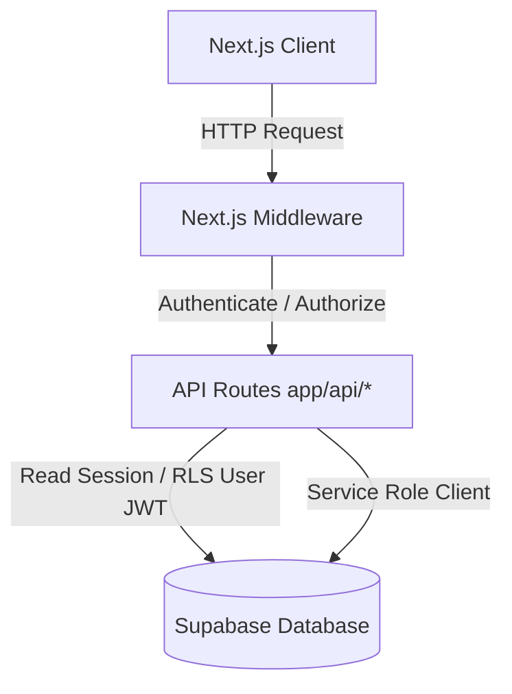

# WashTimePOS — Backend Documentation

> This document details the backend architecture, API routes, data services, and conventions of the WashTimePOS system.
> Update this file whenever a new backend service, route, or helper is modified.

---

## 1. Technical Architecture

The WashTimePOS backend runs as serverless API routes under Next.js 15 App Router. All database queries, transactions, and mutations go through Supabase (PostgreSQL), with role protection enforced via Next.js middleware and Row-Level Security (RLS).

### Database Types

`types/database.types.ts` is auto-generated from the Supabase schema via `npx supabase gen types typescript`. It reflects the exact shape of all 25 tables. **Do not edit this file manually** — regenerate it whenever the schema changes.



---

## 2. Core Modules, Types and Enums

### 2.1 Types and Enums Setup

All TypeScript models and enums are placed in the `types/` folder:

- [database.types.ts](file:///c:/Users/jhoni/Documents/Proyects/washtimepos/types/database.types.ts) — Auto-generated types from Supabase schema. Do not edit directly.
- [enums.ts](file:///c:/Users/jhoni/Documents/Proyects/washtimepos/types/enums.ts) — Explicit project-wide TypeScript enums matching DB `CHECK` constraints.
- [models.ts](file:///c:/Users/jhoni/Documents/Proyects/washtimepos/types/models.ts) — App-level representation of all 25 tables. Imports and re-exports all enums.

### 2.2 System Enums (`types/enums.ts`)

| Enum Name | Values | Used In |
|---|---|---|
| `Role` | `ADMIN`, `SUPERVISOR`, `CASHIER`, `WASHER` | User roles, Middleware access checks |
| `SaleStatus` | `PENDING`, `PAID`, `CANCELLED` | Sales invoice payment state |
| `ShiftStatus` | `OPEN`, `CLOSED` | Daily cashier work shifts |
| `MovementType` | `PURCHASE`, `SALE`, `USE`, `ADJUSTMENT` | Inventory transactions |
| `InventoryType` | `SUPPLY`, `SALE_PRODUCT` | Supplies vs retail products |
| `PromotionStatus`| `ACTIVE`, `DEPLETED`, `EXPIRED`, `DISABLED` | Discount validation |
| `CommissionStatus`| `PENDING`, `PAID` | Employee commission payouts |
| `EquipmentStatus` | `ACTIVE`, `MAINTENANCE`, `INACTIVE` | Car wash machinery |
| `Periodicity` | `ONE_TIME`, `MONTHLY`, `WEEKLY` | Operating cost recurrence label |
| `PaymentMethod` | `CASH`, `NEQUI`, `TRANSFER`, `OTHER` | Transaction ledger records |
| `PromotionType` | `COMBO`, `SERVICE_DISCOUNT`, `INVOICE_DISCOUNT` | Marketing and discounting |
| `ValueType` | `FIXED`, `PERCENTAGE` | Commissions and promotions sizing |
| `RegistrationType`| `MANUAL`, `AUTOMATIC` | Attendance check-in logging |

### 2.3 Application Models (`types/models.ts`)

All 25 entities map to clean, fully typed interfaces:

1. `Company` — Multi-tenant white-label profile
2. `Plan` — SaaS tier subscription definitions
3. `Subscription` — Active plan details per tenant
4. `RoleModel` — Database representation of security roles
5. `User` — Staff members and profiles
6. `VehicleType` — Target vehicles (Car, Motorcycle, Truck, etc.)
7. `Service` — Catalog services offered
8. `ServiceVehicle` — Service × Vehicle Type price matrix
9. `CommissionService` — Base commission rules per service
10. `CommissionEmployee` — Specialized user-specific overrides for service commissions
11. `Vehicle` — Unified client-history vehicle profile (mapped by PK plate)
12. `Promotion` — Marketing rules (combos, items, and total ticket discounts)
13. `SalePromotion` — Ledger of applied invoice promotions
14. `Equipment` — Operating machinery and status tracking
15. `InventoryCategory` — Classification for stock entries
16. `Inventory` — Raw supplies and saleable stock
17. `InventoryMovement` — Audit ledger of all stock alterations
18. `Shift` — Working hours, collections, and closing reconciliations
19. `Sale` — Invoice header records
20. `SaleDetail` — Invoice line-item records (products or services)
21. `Payment` — Transaction payments supporting pre-pay and post-pay flows
22. `CommissionGenerated` — Auto-calculated washer commission payout records
23. `Attendance` — Timecard records for daily presence
24. `CostCategory` — Operational expense categories
25. `OperatingCost` — Expense entries for P&L reporting

## 3. Supabase Clients

Database connections are managed via two distinct, typed Supabase clients:

### 3.1 Browser Client (`lib/supabase/client.ts`)

- **Instantiation**: `createBrowserClient()` (uses `@supabase/ssr` `createBrowserClient` internally)
- **Credentials**: Uses `NEXT_PUBLIC_SUPABASE_URL` and `NEXT_PUBLIC_SUPABASE_ANON_KEY`.
- **Usage**: Used inside client-side services (`/services/*`) and custom React hooks.
- **Cookie management**: `@supabase/ssr` automatically persists the auth session in cookies, enabling middleware to read the session on server-side requests.
- **Security**: Row-Level Security (RLS) is fully enforced via the authenticated user's JWT.

### 3.2 Admin Client (`lib/supabase/admin.ts`)

- **Instantiation**: `createAdminClient()`
- **Credentials**: Uses `NEXT_PUBLIC_SUPABASE_URL` and the highly privileged `SUPABASE_SERVICE_ROLE_KEY`.
- **Usage**: Used **ONLY** in backend serverless API routes (`/app/api/*`).
- **Security**: **Bypasses Row-Level Security (RLS).** Always filter all database queries by `company_id` manually to prevent data leaks.
- **CRITICAL**: Never import this file in components, hooks, or browser services.

## 4. Row-Level Security (RLS) Policies

### 4.1 Login flow policies

Added to `supabase/schema.sql` to fix login 403 error:

| Table | Policy | Rule |
|---|---|---|
| `users` | `Users can read own record` | `USING (id = auth.uid())` |
| `roles` | `Authenticated users can read roles` | `USING (true)` |

**Why needed:** The login page at `app/(auth)/login/page.tsx` runs `SELECT ... FROM users JOIN roles` via the browser client (RLS-enforced). Without these policies, PostgREST returns a 403 `P0001` error and the login flow cannot fetch the user's profile or role.

**Design notes:**
- `roles` is a system table (ADMIN, SUPERVISOR, CASHIER, WASHER) — no sensitive data, so `USING (true)` is safe.
- `users` restricts to `auth.uid()` — a user can only see their own record, preventing data leaks.
- Future policies per table follow the same pattern: `USING (company_id = ...)` where `...` comes from the user's JWT claim.

---

## 6. Authentication & Authorization

Authentication and role-based access control (RBAC) are handled globally via Middleware and a server-side session helper.

### 6.1 Session Helper (`lib/auth.ts`)

- **Function**: `getSessionUser(req: Request | NextRequest)`
- **Behavior**:
  1. Extracts the bearer token from the `Authorization` header or the `sb-access-token` cookie.
  2. Verifies the token using Supabase Auth (`supabase.auth.getUser()`).
  3. Queries the `users` and `roles` tables to fetch the user's name, active status, `company_id`, and role name.
  4. Returns `{ id, name, company_id, role }` or `null` if unauthenticated, inactive, or invalid.

### 6.2 Middleware (`middleware.ts`)

- **Session handling**: Uses `@supabase/ssr` `createServerClient()` with proper cookie `getAll()`/`setAll()` handlers. Reads the auth session from Supabase-managed cookies — no manual cookie setting needed.
- **Interception**: Intercepts all pages and API routes except public routes (`/login`, `/unauthorized`) and static assets (any file with a `.` extension via the matcher).
- **Route Authorization Map**:
  - `/admin/*` ➔ `ADMIN`
  - `/supervisor/*` ➔ `ADMIN`, `SUPERVISOR`
  - `/cashier/*` ➔ `ADMIN`, `SUPERVISOR`, `CASHIER`
  - `/employee/*` ➔ `ADMIN`, `SUPERVISOR`, `CASHIER`, `WASHER`
- **Redirects & Responses**:
  - **No Session**: Redirects page requests to `/login` with `redirectTo` search parameter; returns `401 Unauthorized` JSON for API requests.
  - **Insufficient Permissions**: Redirects page requests to `/unauthorized`; returns `403 Forbidden` JSON for API requests.
- **2026-06-10 update**: Rewritten from manual cookie-based auth (`getSessionUser`) to `@supabase/ssr` to fix infinite redirect loop caused by client-set cookies not reaching the middleware during client-side navigation.
- **2026-06-11 update**: Removed the auto-redirect from `/login` for already-authenticated users. Middleware no longer redirects from public routes — the login page's `restoreSession()` handles client-side redirect, which properly populates Zustand before navigating. Removed unused `getDashboardRoute` and `redirectMap`.

---

## 7. Backend Conventions

### 7.1 JSDoc Standards

All backend service methods and API routes must be documented using JSDoc. Define parameters, exceptions, rules, and returns clearly:

```ts
/**
 * Calculates and inserts washer commissions based on current agreements.
 *
 * @param detailId - UUID of the sale detail line
 * @param employeeId - UUID of the target worker
 * @returns Generated commission record
 */
```

## 8. API Routes

### 8.1 Shifts

#### `POST /api/shifts/open` — Open a new shift

- **Minimum role**: `CASHIER`
- **Request body**: `{ opening_cash: number }` (validated via `openShiftSchema`)
- **Process**:
  1. Authenticates user via `getSessionUser()` — 401 if no session, 403 if role below CASHIER
  2. Validates `opening_cash >= 0` with Zod — 422 if invalid
  3. Checks no OPEN shift exists for the company — 400 if one already exists
  4. Creates shift record with `company_id` from session, `opened_by` = user id, `status = OPEN`, `opening_cash`
- **Returns**: `201` with shift data
- **Location**: `app/api/shifts/open/route.ts:10`

#### `POST /api/shifts/close` — Close the current shift

- **Minimum role**: `CASHIER`
- **Request body**: `{ notes?: string }` (validated via `closeShiftSchema`)
- **Process**:
  1. Authenticates user — 401/403
  2. Validates body — 422 if `notes` is not a string
  3. Finds OPEN shift for the company — 404 if none exists
  4. Fetches all sales for the shift, their detail lines, and payments
  5. Computes: `total_sales` (sum of sale totals), `total_services` (count of lines with service_id), `total_unassigned` (count of lines with assigned = false), `total_cash` (sum of CASH payments), `total_digital` (sum of non-cash payments)
  6. Updates shift status to CLOSED, sets `closed_by`, `closed_at`, and computed totals
- **Returns**: `200` with closed shift summary
- **Location**: `app/api/shifts/close/route.ts:10`

### Tests
- `tests/api/shifts.test.ts` — 11 tests covering both open and close
  - Happy: creates shift on open, computes and closes with totals
  - Auth: 401 no session, 403 WASHER role
  - Validation: 422 missing/negative opening_cash, 422 invalid notes type
  - Business: 400 shift already open, 404 no open shift to close

---

## 9. Service Layer

### 9.1 Shifts Service (`services/shifts.service.ts`)

Three exported functions encapsulating all shift data logic:

| Function | Params | Returns | Description |
|---|---|---|---|
| `getActiveShift` | `companyId: string` | `Promise<Shift \| null>` | Returns the current OPEN shift for a company, or null. Called on every POS page load. |
| `openShift` | `{ company_id, opened_by, opening_cash }` | `Promise<Shift>` | Checks no OPEN shift exists, then creates one. Throws if already open. |
| `closeShift` | `shiftId, userId, notes?` | `Promise<Shift>` | Computes totals from sales, counts services and unassigned lines, breaks down cash vs digital payments. Throws if not found or already closed. |

**Business rules enforced:**
- All monetary totals computed server-side from DB — never trusted from client
- `total_services` counts `sale_details` where `service_id IS NOT NULL`
- `total_unassigned` counts lines where `assigned = false`
- Only one OPEN shift allowed per company (checked on open)
- Already-closed shifts cannot be closed again

---

## 10. Validation Schemas

### 10.1 Shift Schemas (`lib/validations/shift.schema.ts`)

- `openShiftSchema`: `{ opening_cash: z.coerce.number().min(0) }`
- `closeShiftSchema`: `{ notes: z.string().optional() }`
- Exports: `OpenShiftInput`, `CloseShiftInput` types

---

## 11. Error and Null Handling

- Database errors must never leak raw messages to the client.
- Return HTTP status codes reflecting outcomes (e.g., `401 Unauthorized`, `403 Forbidden`, `422 Unprocessable Content`).
- Logs should use clean context tags: `console.error('[context_name]', error)`.
